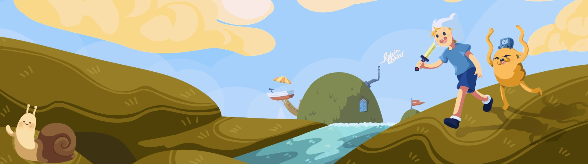
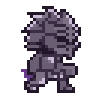

<h1 align="center">Hi, I'm Robin!  </h1>
<h3 align="center">A self-taught artist and programmer from Spain.</h3>

#### ⚙ Currently working on:

[**Salva a la princesa**](https://github.com/RobinDoblas/Salva-a-la-princesa)

#### 🎓 Currently learning

[Certified Full-Stack Developer Curriculum](https://www.freecodecamp.org/learn/full-stack-developer-v9/)
#### 👻 About me 

*I am an eager and passionate fast learner*

***

<h3 align="left">Languages and Tools:</h3>

  
  
  
  
  
  
  
  
  
  
  
  
  
  
  
  
  
  
  

<h3 align="left">Socials:</h3>

  
  

<h3 align="left">Projects</h3>

- 🎮 Videogames: 
  - [Salva a la princesa](https://github.com/RobinDoblas/Salva-a-la-princesa)
  - [Mantén pulsado o mueres](https://github.com/RobinDoblas/Manten-pulsado-o-mueres)
- 💻 Website: [Author website](https://github.com/RobinDoblas/author-website)
- 📖 Learning: 
  - FreeCodeCamp PSQL: 
    - [Number Guessing Game](https://github.com/RobinDoblas/PSQL-Number-Guessing-Game)
    - [Periodic Table Database](https://github.com/RobinDoblas/PSQL-Periodic-Table-Database)
    - [Salon Appointment Scheduler Database](https://github.com/RobinDoblas/PSQL-Salon-Appointment-Scheduler-Database)
    - [World Cup Database](https://github.com/RobinDoblas/PSQL-World-Cup-Database-)
    - [Universe Database](https://github.com/RobinDoblas/PSQL-Universe-Database)
  - [Retos de programación](https://github.com/RobinDoblas/retos_de_programacion)